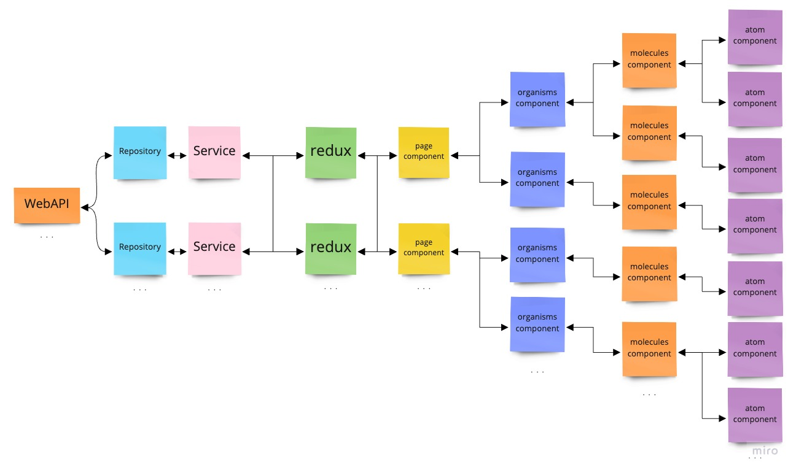

# eslint-plugin-coding-rules

eslint plugin for making coding rules.

## installation

```
npm install --save-dev eslint-plugin-coding-rules
```

Then, in your `.eslintrc.json`

```
{
  "plugins": ["coding-rules"],
}
```

Finally, enable rules that you would like to use.

```
  "rules": {
    "no-use-specific-imports": [
      "error", [
        {
          filePath: [
            "**/components/**",
          ],
          importName: ["react-redux", "**/stores"],
        },
        {
          filePath: [
            "**/pages/**",
          ],
          importName: ["**/*Service", "**/ServiceFactory"],
          message: "'{{importSource}}'からは'{{importFrom}}'をインポートすることはできません。",
        },
      ]
    ]
  }
```

## Rule Details

### no-use-specific-imports

Disallow specific imports from specific dirs or source files.

### Options

format is

```
{
  filePath: string | string[],
  importName: string | string[],
  message?: string
}[]
```

| key        | types              | description                                                     |
|------------|--------------------|-----------------------------------------------------------------|
| filePath   | string or string[] | Enter paths where the target file is located.                   |
| importName | string or string[] | Enter the name of the libraries for which import is prohibited. |
| message    | string             | custom error message.                                           |

#### message format

| key              | description                    |
|------------------|--------------------------------|
| {{importSource}} | replaces the source file path. |
| {{importFrom}}   | replaces the import name.      |

### example

```
  "rules": {
    "no-use-specific-imports": [
      'error',
      [
        {
          filePath: [
            "**/components/**",
          ],
          importName: ["react-redux", "**/stores"],
        },
        {
          filePath: [
            "**/pages/**",
          ],
          importName: ["**/*Service", "**/ServiceFactory"],
          message: "'{{importSource}}'からは'{{importFrom}}'をインポートすることはできません。",
        },
      ]
    ]
  }
```

Files with paths that match `filePath` will not be able to import the library specified by `importName`.

- `components/atoms/ButtonAtom.tsx` can not import `react-redux` or `**/stores`.
- `pages/MainPage.tsx` can not import `**/Service` or `**/ServiceFactory`.

#### architecture example



- `**/components/atoms/**`, `components/moleculres/**`, `**/components/organisms/**` can not import redux directly.
- `**/components/atoms/**`, `components/moleculres/**`, `**/components/organisms/**`, `**/pages/**`, can not import service files directly.

Control the data processing flow by preventing direct import.

react sample code is here [sample code](./test/samples/react)

### Implementation
* [Rule source](./src/rules/no-use-specific-imports.ts)
* [Test source](./test/rules/no-use-specific-imports.test.ts)
